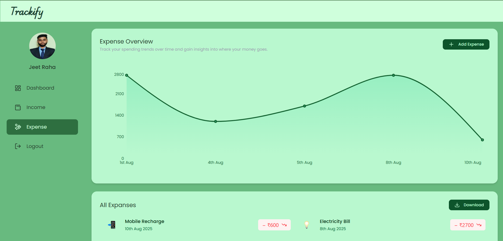
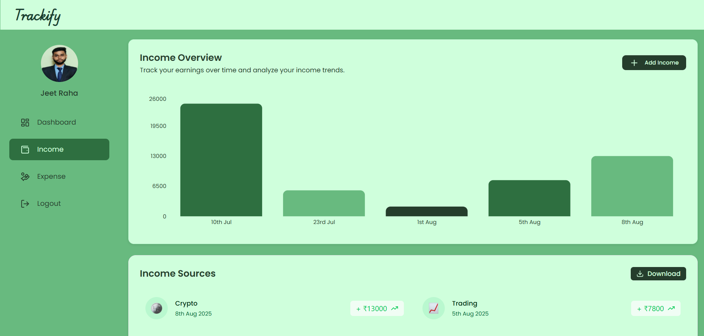

# 🚀 Trackify — Expense Tracker Web Application


Trackify is a **secure, full-stack expense tracking web application** built using the MERN stack. It enables users to track income and expenses, visualize spending patterns through interactive charts, and export financial data for better money management.

---

## ✨ Key Highlights

- 🔐 JWT-based secure authentication
- 📊 Real-time expense analytics with interactive charts
- 📝 Full CRUD support for income & expenses
- 🗂 Category-wise expense management
- 📥 Export data to Excel format
- 📱 Responsive UI for all devices

---

## 🛠 Tech Stack

| Layer | Technologies |
|-----|-------------|
| Frontend | React.js, Chart.js |
| Backend | Node.js, Express.js |
| Database | MongoDB |
| Authentication | JWT |
| Utilities | ExcelJS |

---

## 📸 Project Screenshots

 

### Dashboard


### Add Expense


### Analytics


---

## 📂 Folder Structure

```text
trackify-expense-tracker/
│── backend/
│── frontend/
│── screenshots/
│── README.md
